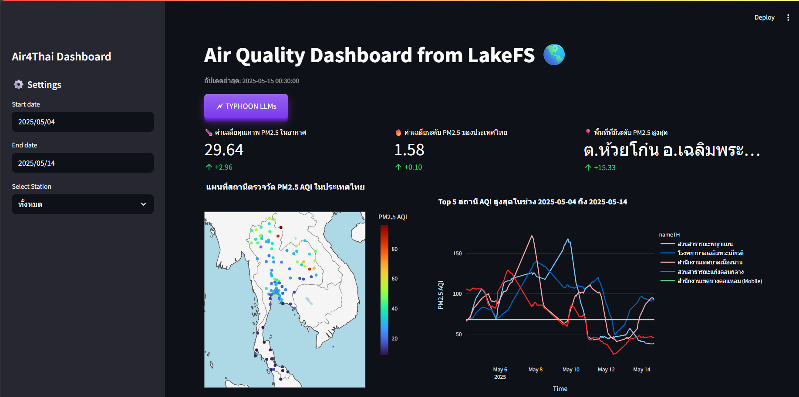

# Automate Data Pipelines for Real-Time Analytics using Prefect.io


### 📌 Project Overview
This project is part of the <b>DSI321: BIG DATA INFRASTRUCTURE</b> course.It focuses on designing and deploying an automated data pipeline for real-time analytics using Prefect.io. The data collected relates to PM2.5 air quality levels in Thailand. The system is containerized with Docker, orchestrated by Prefect, visualized with Streamlit, and further enhanced by integrating a large language model—Typhoon LLM—to provide intelligent summarization and user-friendly insights.

### 🧾 Introduction 
In recent years, air pollution—especially fine particulate matter (PM2.5)—has become a critical environmental issue in Thailand  . Accurate and timely monitoring of air quality is essential for public awareness, health decision-making, and long-term policy planning. To support this need, this project focuses on building an automated data pipeline that continuously collects, processes, and analyzes air quality data in near real-time.
<br>
<br>
The pipeline utilizes the <a href=https://envilink.go.th/dataset/air-quality-pm2point5/resource/156ca885-4f38-4c58-8745-397552105c1e><b>Air Quality API</b></a>, which provides hourly average PM2.5 concentration data from automatic air quality monitoring stations operated by the <b>Air4Thai</b> network across the country. This API is officially maintained by the <b>Pollution Control Department of Thailand</b>, offering reliable access to high-quality environmental data.
<br>
<br>
To ensure automation, scalability, and reproducibility, the project leverages<a href=https://www.prefect.io><b> Prefect.io</b></a> for workflow orchestration and <a href=https://www.docker.com><b>Docker</b></a> for containerization. Insights from the processed data are visualized using a web-based dashboard built with Streamlit.

To make the insights even more accessible and easier to interpret, the project integrates <a href=https://opentyphoon.ai><b>Typhoon LLM</b></a> to generate natural language summaries of air quality trends. The language model helps interpret PM2.5 data by identifying significant changes, highlighting anomalies, and providing region-specific recommendations in both Thai and English. Users can interactively explore real-time data and receive AI-powered explanations via the dashboard—bridging the gap between complex analytics and everyday understanding.
<br>
<br>


### 🚀 Getting Started
To run it locally:

1. **Clone the Repository**:

   ```bash
   $ git clone <this-repo-url>

   $ cd <this-repo-folder>
   ```    
2. **Start Docker Services**:
   Launch Prefect server and Streamlit:
   ```bash
   docker-compose up -d --build
   ```
   After successful deployment, you can access: <br>
   <b>Prefect Dashboard</b> : http://localhost:4200 <br>
   <b>JupyterLab</b> :  http://localhost:8888 <br>
   <b>LakeFS</b> : http://localhost:8001 (changed from default 8000) <br>
   <b>Stramlit</b> : http://localhost:8501

> [!IMPORTANT]  
> Before executing `deploy.py`, you must first **create a repository named `air-quality-data` in LakeFS**.  

> [!TIP]  
> You can do this via the LakeFS web interface or using the CLI command:  
> ```
> lakectl repo create lakefs://air-quality-data
> ```


3. **Deploy Prefect Flow**:
   Deploy the pipeline with a start of the hour (minute 40).:
   ```bash
   python src/pipeline.py deploy

   # OR via JupyterLab at http://localhost:8888
   ## Start new terminal session

   python deploy.py
   ```
   This creates a deployment named `data-pipeline` in the `default-agent-pool` work pool, scheduled to run at minute 40 of every hour. (`cron="40 * * * *"`).

## <b>📊 Streamlit Interface</b> : Real-Time Air Quality Dashboard



### <b>Key Dashboard Features:</b>

- <b>Real-time PM2.5 visualization</b> for various provinces

- <b>Time-series trend graphs</b> for selected stations

- <b>Interactive map</b> with station markers and AQI color coding

- <b>Typhoon LLM-powered summary insights</b> per region/time

## 🤖 <b>Typhoon LLM Integration:</b> Summarization & Insight Generation
To enhance the real-time air quality dashboard, we integrated Typhoon LLM, a Thai language large language model, to automatically generate concise summaries and actionable insights from air quality data.

### <b>Why Typhoon LLM?</b>
- <b>Thai Language Support</b> <br>
Typhoon LLM is trained on extensive Thai text data, making it ideal for interpreting and generating insights in Thai for local users.

- <b>Powerful for Summarization</b> <br>
It excels at summarizing trends and highlighting anomalies, such as identifying provinces with unusually high PM2.5 levels or suggesting areas that may require attention.

- <b>Real-Time Integration</b> <br>
Combined with Prefect and Streamlit, Typhoon LLM enables real-time insight generation as new data flows in.

### <b>Techniques Used</b>
- <b>Prompt Engineering</b> <br>
We designed clear and structured prompts, e.g.:
“Summarize the air quality situation in Thailand for {time range} and highlight provinces with high PM2.5 levels.”

- <b>Workflow Integration via Prefect</b> <br>
A task was added in the Prefect pipeline to send cleaned and updated data to Typhoon LLM for automatic summarization.

- <b>Insight Cards in Streamlit</b> <br>
The model's output is displayed as user-friendly “insight cards” on the dashboard, helping users quickly understand key information without analyzing charts in detail.

## 🧬 Data Schema

The data schema is defined in `src/SCHEMA.md`. For this air quality data example:

```
{
  "columns": [
    "timestamp", "stationID", "nameTH", "nameEN", "areaTH",
    "areaEN", "stationType", "lat", "long", "PM25.color_id",
    "PM25.aqi", "year", "month", "day", "hour"
  ],
  "types": [
    "datetime64[ns]", "string", "string", "string", "string", 
    "string", "string", "float64", "float64", "int64",  
    "float64", "int64", "int64", "int32", "int32"
    ],
  "key_columns": [
    "timestamp", "stationID", "nameTH", "nameEN", "areaTH",
    "areaEN", "stationType", "lat", "long", "PM25.color_id",
    "year", "month", "day", "hour"
  ]
}
```

- **timestamp**: ISO format timestamp of data collection.  
- **stationID**: Station ID code.  
- **nameTH**: Station name in Thai.  
- **nameEN**: Station name in English.  
- **areaTH**: Area name in Thai.  
- **areaEN**: Area name in English.  
- **stationType**: Type of the station (e.g., roadside, general area).  
- **lat**: Latitude of the station.  
- **long**: Longitude of the station.  
- **PM25.color_id**: Color ID for visualization based on PM2.5 level.  
- **PM25.aqi**: PM2.5 Air Quality Index (AQI).  
- **year**: Year of data record.  
- **month**: Month of data record.  
- **day**: Day of data record.  
- **hour**: Hour of data record.

Key columns are used for data quality checks (no missing values allowed).

## 🛠️ Technologies Used
- <b>Prefect.io</b> - For workflow orchestration and scheduling
- <b>Docker</b> - For containerizing the application and ensuring environment consistency
- <b>LakeFS</b> - For data versioning and management
- <b>Streamlit</b> - For interactive data visualization
- <b>Typhoon LLM</b> - For natural language summarization of air quality data
- <b>Air Quality API</b> - For real-time PM2.5 data from the Air4Thai network

## 📫 Support & Contact
If you have any questions, suggestions, or need assistance, please open an issue or contact the developer directly.🤝
<br>
<br>

<div align="center">
  <p>DSI321: BIG DATA INFRASTRUCTURE | <a href="https://github.com/KorNxHaidar">KorNxHaidar</a> | 2025</p>
  
  
</div>